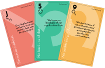

---

layout: col-sidebar
title: OWASP Cumulus
tags: example-tag
level: 2
type: 
pitch: Cumulus. Threat Modeling the Clouds.

---

# *Threat modeling the clouds*

Cumulus is the easy way to bring security into cloud and devOps teams.

As a variant of the card game Elevation of Privilege it follows the idea to threat model a system via gamification.
This lightweight and low-barrier approach helps you find threats to your devOps or cloud project and teaches the developers a security oriented mindset.

Find the latest release [here](https://github.com/OWASP/cumulus/releases/latest).

## Threat Modeling 
The idea of threat modeling via serious games goes back to the card game [Elevation of Privilege](https://shostack.org/games/elevation-of-privilege) by [Adam Shostack](https://github.com/adamshostack).
The basic idea is to bring the developers on a table and get them start discussing the security of their system.
For this, a card game serves as a guide through a catalogue of threats.
It is designed to be low-barrier and naturally embeddable within agile development processes.

While the original game approaches security in general and another variant, Cornucopia by the OWASP Foundation, targets (web) application security in particular, we had the feeling that the specific needs of devOps team working in cloud environments have been missing.
Cumulus seeks to fill this gap and provides a custom card deck with threats to cloud systems.

Threats are classified into the categories (which are also the suits in this game):
* Access & Secrets
* Delivery
* Recovery
* Monitoring
* Resources

This game does explicitly **not** try to replace Elevation of Privilege or Cornucopia.
It should rather be seen as part of a triplet of threat modeling card decks, reflecting different aspects of modern software development projects.
  
## Acknowledgements 
The original and wonderful idea of conducting threat modeling via serious games goes back to [Adam Shostack](https://github.com/adamshostack), working for Microsoft at that time.
He invented the game [Elevation of Privilege](https://shostack.org/games/elevation-of-privilege) which is the blue print for Cumulus.

Another great game following Elevation of Privilege's approach to threat modeling is [Cornucopia](https://owasp.org/www-project-cornucopia/) developed by the [OWASP Foundation](https://owasp.org/).

Both card games are great tools to help development teams increase the security of the system they are building.

However, we felt the need for a threat modeling card game targeting devOps/cloud projects in particular.
Out of this idea, Cumulus arose.
  
## Online Version
There exists an [online version](https://github.com/tng/elevation-of-privilege) of this card game (and also Elevation of Privilege and Cornucopia) for remote or geographically distributed teams.
This can easily be self-hosted.

You can find it under: 
  
[https://github.com/tng/elevation-of-privilege](https://github.com/tng/elevation-of-privilege) 
  
 ## Versioning 
The card deck follows [semantic versioning](https://semver.org/).
Version changes mean: 

- *patch version*: Non-semantic changes: layout, typos, minor re-wordings, ...
- *minor version*: Semantic changes: rephrasings, additional cards...
- *major version*: Substantial semantic changes: new categories, ...
  
## Licensing 
The card game (including the threat formulations and the released PDF files are distributed under [CC-BY-4.0](https://creativecommons.org/licenses/by/4.0/).
When distributing this game, mentioning [TNG Technology Consulting](https://www.tngtech.com/en/index.html) is highly appreciated.

All utils files (shell scripts, LaTeX code for layouting) are distributed under [Apache-2.0](https://www.apache.org/licenses/LICENSE-2.0).
